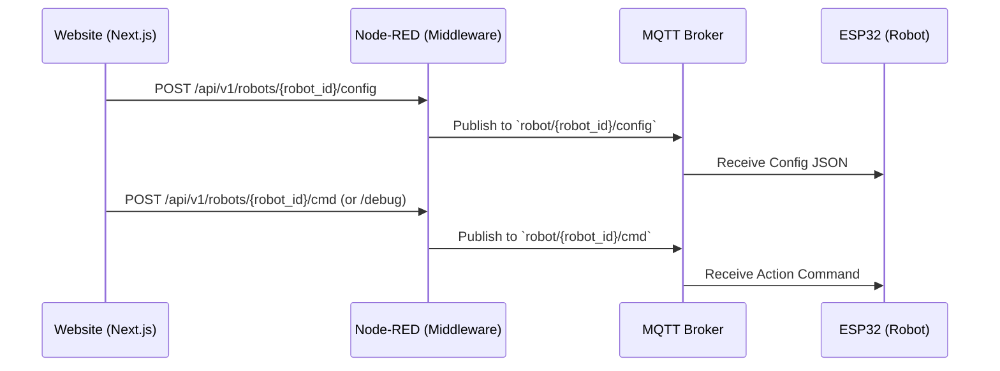

# Node-RED & MQTT Integration

## Overview
The Vertical Forest Dashboard relies on **Node-RED** as a middleware to translate web-based REST API calls into lightweight **MQTT** messages for real-time hardware communication. 

While the ESP32 hardware supports fetching its configuration via HTTP polling (`GET /api/config`), the Node-RED and MQTT integration allows the dashboard to **push** real-time operational and debug commands to the robots instantly.

## Architecture Data Flow

## REST API Endpoints (Next.js -> Node-RED)
When a user performs an action in the dashboard (e.g., sending a debug command or saving setup configuration), the Server Actions in `actions/robots.ts` make HTTP POST requests to Node-RED:

1. **Push Configuration**
   - **Endpoint:** `POST /api/v1/robots/{robot_id}/config`
   - **Payload:** Full JSON configuration (Pots, Plant templates, Moisture targets)
   - **Purpose:** Forces the robot to immediately update its running configuration without waiting for the next HTTP polling cycle.

2. **Send Command**
   - **Endpoint:** `POST /api/v1/robots/{robot_id}/cmd`
   - **Payload:** `{ "command": "START_WATERING" }`
   - **Purpose:** Sends operational commands to the hardware.

3. **Send Debug Command**
   - **Endpoint:** `POST /api/v1/robots/{robot_id}/debug`
   - **Payload:** `{ "command": "MOVE_TRACK_1" }`
   - **Purpose:** Low-level testing and diagnostics.

## Hardware Synchronization Strategy
The system utilizes a dual-sync strategy to ensure maximum reliability:
1. **Active Push (MQTT):** Dashboard triggers Node-RED to push updates immediately via MQTT.
2. **Passive Pull (HTTP):** The ESP32 robot periodically polls the `GET /api/config` endpoint on the Next.js server as a fallback to ensure it is always running the latest configuration, even if MQTT connectivity drops.
